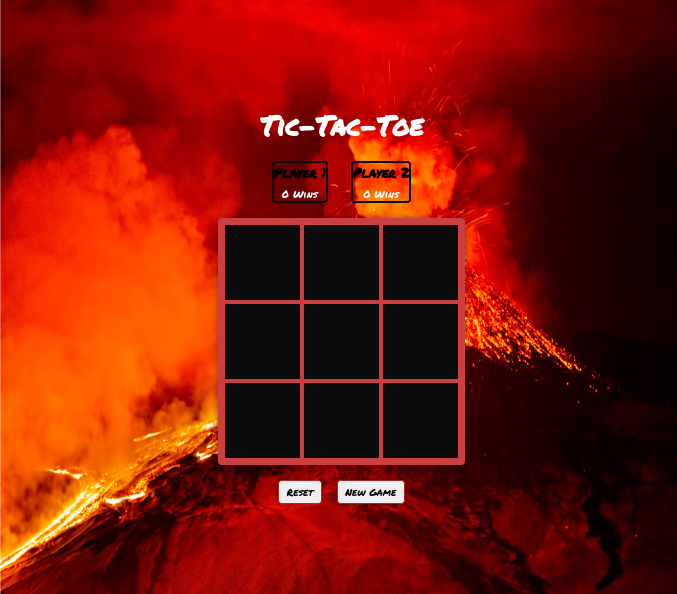

# Tic-Tac-Toe Game README

## Description
This is a simple implementation of the classic Tic-Tac-Toe game created using HTML, CSS, and JavaScript. It's a single-player game where you, as Player 1 (X), compete against a computer opponent, Player 2 (O), which utilizes AI moves. 

## Play the Game
You can play the game by visiting the following link: [Play Tic-Tac-Toe](https://thakiddx.github.io/ticTacToe/)

## Features
- Single-player mode: Challenge the computer with AI moves.
- Reset and New Game buttons: Easily restart the game or start a new one.
- Custom modal: Informative modals for game status and messages.

## Installation
1. Clone or download this repository to your local machine.
2. Open the `index.html` file in your web browser to start playing.

## How to Play
- Player 1 (X) starts the game.
- Click on an empty cell to place your marker (X).
- The first player to get three markers in a row, column, or diagonal wins.
- If all cells are filled, and no player has won, the game is a draw.

## AI Opponent (Single-Player Mode)
- In single-player mode, you can challenge the computer (Player 2).
- The computer uses the minimax algorithm to make optimal moves.

## Custom Modal
- The game features a custom modal to display important messages.
- It is used to announce the winner, a draw, or when a game is reset or started.

## Implementation Details
- **DOM Manipulation**: The game utilizes DOM manipulation to dynamically update the game board and messages.
- **Iteration**: Loops are used for board initialization, checking for a win, and determining available moves.
- **Event Listeners**: Event listeners are used to capture user clicks on the game board.
- **Minimax Algorithm**: The computer's AI opponent uses the minimax algorithm to make strategic moves.

## Credits
- Background image by [Your Image Source](https://s.yimg.com/uu/api/res/1.2/L9_inY3d.Eu0icGQS88Cow--~B/aD0zMTY4O3c9NDc1MjtzbT0xO2FwcGlkPXl0YWNoeW9u/https://media-mbst-pub-ue1.s3.amazonaws.com/creatr-images/2019-12/d2f2ce90-1aa7-11ea-bb5b-5880037b54f0).
- Fonts: [Google Fonts](https://fonts.google.com).

## Technologies Used

This Tic-Tac-Toe game was developed using a combination of web technologies to create an engaging and interactive experience for players. Here's an overview of the key technologies and tools used in this project:

- **HTML**: The game's structure and layout are built using HTML, providing the foundation for the user interface.

- **CSS**: CSS stylesheets are used to customize the game's appearance, including fonts, colors, and layout design.

- **JavaScript**: JavaScript is the core programming language used to implement game logic, user interactions, and AI functionality.

- **DOM Manipulation**: The Document Object Model (DOM) is leveraged to dynamically update the game board, messages, and UI elements in response to user actions and game events.

- **Event Listeners**: JavaScript Event Listeners are employed to capture user clicks on the game board, enabling interactivity and gameplay.

- **Minimax Algorithm**: The game's AI opponent (Player 2) utilizes the minimax algorithm to make strategic moves and challenge the player.

- **Version Control (Git/GitHub)**: Git and GitHub are used for version control and collaboration, allowing for code management and sharing with others.

- **Online Hosting**: The game is hosted online using GitHub Pages, making it accessible to players from anywhere with an internet connection.

These technologies work together to create a seamless and enjoyable gaming experience, combining frontend development, game logic, and AI algorithms to bring the classic Tic-Tac-Toe game to life in the browser.

## Resources
Here are the resources that were instrumental in creating this project:
- [W3Schools JavaScript Array Methods](https://www.w3schools.com/js/js_array_methods.asp)
- [Figma](https://www.figma.com/)
- [Eloquent JavaScript](https://eloquentjavascript.net/)
- [Stack Overflow](https://stackoverflow.com/)
- [MDN Web Docs](https://developer.mozilla.org/en-US/)
- [W3C CSS2 Selector Reference](https://www.w3.org/TR/CSS2/selector.html)
- [CommonMark Markdown Guide](https://commonmark.org/help/)
- [Alia Alaa's Blog on Tic-Tac-Toe with Minimax](https://alialaa.com/blog/tic-tac-toe-js-minimax)
- [freeCodeCamp](https://www.freecodecamp.org/learn/)
- [YouTube: The minimax algorithm in 3 minutes](https://www.youtube.com/watch?v=N5DRomy0F08&list=LL&index=1&t=52s)
- [YouTube: JavaScript Tic Tac Toe Project Tutorial - Unbeatable AI w/ Minimax Algorithm](https://www.youtube.com/watch?v=P2TcQ3h0ipQ&list=LL&index=2&t=1100s)
- [YouTube: What is the Minimax Algorithm? - Artificial Intelligence](https://www.youtube.com/watch?v=KU9Ch59-4vw&list=LL&index=5&t=3s)
- [YouTube: THE ODIN PROJECT: TIC TAC TOE | PROJECT SOLUTION](https://www.youtube.com/watch?v=kVE4xX-OkJo&list=LL&index=9&t=88s)

## Acknowledgments
- ChatGPT
- My teacher and instructor, Chris Van Halen

## Development Process

The development of this Tic-Tac-Toe game was a journey that involved thorough research, planning, and hands-on coding. Here's an in-depth look at the various stages of the development process:

### Research

I devoted a significant portion of my time to research before diving into coding. This involved reading articles, watching YouTube videos, and exploring documentation related to JavaScript, game development, and artificial intelligence. This research phase allowed me to gather insights, understand best practices, and gain inspiration from existing projects.

### Wireframing

Before writing a single line of code, I created a wireframe for the game's user interface. This wireframe served as a blueprint for the layout and visual design of the game. It helped me envision the user experience and plan the placement of elements such as the game board, buttons, and modals.

### Pseudocode Preparation

To streamline my thought process and establish a clear game logic foundation, I wrote pseudocode. This step was instrumental in breaking down the game's functionality into smaller, manageable steps. It helped me define the rules of the game, plan the win condition logic, and outline the behavior of the computer opponent powered by the minimax algorithm.

### Implementation Challenges

Throughout the development process, I encountered challenges related to win condition checking, score tracking, and modal design. I learned that precise condition checking using `!==f` was essential for accurately identifying wins. The dynamic update of scores, as seen in `computerScore.textContent = `${computerWins} Wins` `, was a key element. Additionally, creating a custom modal for displaying game messages required mastering DOM manipulation and CSS styling.

This project was a valuable learning experience that combined research, planning, and hands-on development. It reinforced the importance of preparation and problem-solving in web development. The combination of research, wireframing, pseudocode, and hands-on coding resulted in the successful creation of this Tic-Tac-Toe game.

The dedication to research and planning laid a solid foundation for the coding phase, ensuring a smoother and more organized development process.

## Author
- Xavier L. Malone
- Contact: [xmalone0920@gmail.com](mailto:xmalone0920@gmail.com)

## License
This project is licensed under the MIT License.

Enjoy playing Tic-Tac-Toe!

[Tic-Tac-Toe](https://thakiddx.github.io/ticTacToe/)

